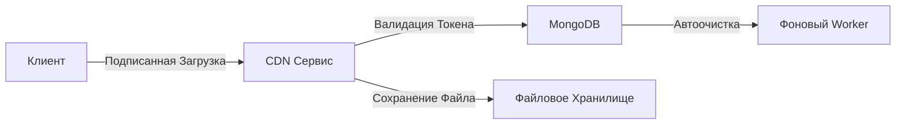
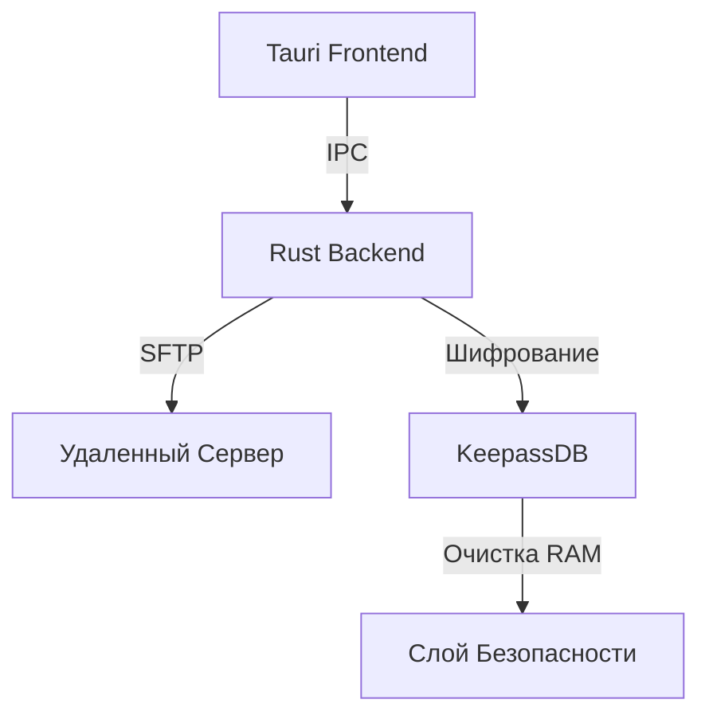

# Архивный Аккаунт

## Технологический Стек

```rust
// Основные технологии
Бэкенд      → TypeScript, Node.js, Rust
Desktop     → Tauri, Electron
Автоматизация → GitHub Actions, CLI Tools
Безопасность  → RSA, OpenSSL, KeepassDB
```

<div align="center">


</div>

---

## Избранные Проекты

### 🦀 Высокопроизводительная Инфраструктура

<table>
<tr>
<td width="50%">

**[secureserve-cdn-2024](https://github.com/uwu-loli/secureserve-cdn-2024)**

Production-ready CDN микросервис на Actix-web

```rust
- Signed uploads (30min TTL)
- MongoDB metadata storage  
- Auto-cleanup expired tokens
- 1500+ trans/sec throughput
```

**Stack:** `Rust` `Actix-web` `MongoDB` `Tokio`

</td>
<td width="50%">

**[udp-proxy](https://github.com/uwu-loli/udp-proxy)**

Оптимизированный UDP-прокси для высоких нагрузок

```rust
- Асинхронная обработка (Tokio)
- Automatic client cleanup
- Multi-threaded architecture
- Low-latency forwarding
```

**Stack:** `Rust` `Tokio` `UDP`

</td>
</tr>
</table>

### 🖥️ Desktop Приложения

<table>
<tr>
<td width="50%">

**[Novafile-2024](https://github.com/uwu-loli/Novafile-2024)**

Третья версия ModernFTP с улучшенной безопасностью

```typescript
- Tauri + Rust backend
- KeepassDB integration
- Memory-safe password handling
- Cross-platform support
```

**Stack:** `Tauri` `Rust` `Vue/Nuxt` `KeepassDB`

</td>
<td width="50%">

**[modern-ftp-2023](https://github.com/uwu-loli/modern-ftp-2023)**

Multi-language FTP/SFTP клиент

```csharp
- Electron GUI + Acrylic UI
- FTP (C# + FluentFTP)
- SFTP (Rust + ssh2, C# + SSH.NET)
- Drag-and-drop interface
```

**Stack:** `Electron` `Rust` `.NET` `C#`

</td>
</tr>
</table>

### 🔐 Безопасность и Криптография

<table>
<tr>
<td width="50%">

**[encrypt-test-crypto-2023](https://github.com/uwu-loli/encrypt-test-crypto-2023)**

Эксперименты с RSA шифрованием

```rust
- RSA-2048 + OAEP + SHA-512
- Cross-platform compatibility
- Node.js / Web Crypto interop
- PEM key management
```

**Stack:** `Rust` `OpenSSL` `JavaScript`

</td>
<td width="50%">

**[cheat-finder-winapi-2024](https://github.com/uwu-loli/cheat-finder-winapi-2024)**

Форензик-утилита для детектирования читов

```rust
- x86-64 дизассемблер (iced-x86)
- Pattern matching в бинарниках
- Windows Firewall API
- Recursive disk scanning
```

**Stack:** `Rust` `iced-x86` `WinAPI`

</td>
</tr>
</table>

### 🎮 Разработка Игр

<table>
<tr>
<td>

**[Qurre-v1-source](https://github.com/uwu-loli/Qurre-v1-source)**

Plugin framework для SCP: Secret Laboratory

```csharp
- Event-driven architecture
- Harmony-based patching
- Dynamic plugin loading
- Extensive API для модификации игровой логики
```

**Stack:** `C#` `Harmony` `Unity`

</td>
</tr>
</table>

### 🌐 Бэкенд и Веб

<table>
<tr>
<td>

**[monopoly-web-2024](https://github.com/uwu-loli/monopoly-web-2024)**

NestJS backend для игры в монополию

```typescript
- JWT + RSA authentication
- PostgreSQL (Knex ORM)
- Redis caching & sessions
- Social features (friends, comments)
```

**Stack:** `NestJS` `TypeScript` `PostgreSQL` `Redis`

</td>
</tr>

<tr>
<td>

**[fydne-prod-web-2020-2023](https://github.com/uwu-loli/fydne-prod-web-2020-2023)**

Production code (2020-2023) — первый проект с реальной продакшн нагрузкой

```
- Full-stack web application
- 3 years of active development
- Real production experience
```

</td>
</tr>
</table>

---

## Статистика

<div align="center">


</div>

### Обзор Репозиториев

```yaml
Всего репозиториев: 226
Публичных: 224
Архивных: 226
Основные языки:
  - TypeScript / JavaScript: Бэкенд, автоматизация, инструменты
  - Rust: Высокопроизводительные системы, безопасность
  - C#: Игровые плагины, desktop приложения
  - Node.js: Бэкенд сервисы, CLI инструменты
```

### Ключевые Метрики

<div align="center">

| Категория | Проектов | Технологии |
|----------|----------|-------------|
| **Бэкенд** | 15+ | NestJS, Actix-web, Node.js |
| **Desktop** | 8+ | Tauri, Electron, Rust |
| **Безопасность** | 5+ | OpenSSL, RSA, KeepassDB |
| **Разработка Игр** | 10+ | Unity, C#, Harmony |
| **Автоматизация** | 20+ | GitHub Actions, CLI |

</div>

---

## Категории Проектов

### По Технологиям

<details>
<summary><b>TypeScript / Node.js Проекты</b></summary>

- Бэкенд API (NestJS, Express)
- CLI инструменты и автоматизация
- Системы сборки и инструментарий
- Интеграции с GitHub Actions
- Системы синхронизации шаблонов

</details>

<details>
<summary><b>Rust Проекты</b></summary>

- Высокопроизводительные сетевые решения (UDP прокси, CDN)
- Инструменты безопасности (криптография, античит)
- Desktop приложения (Tauri)
- FTP/SFTP клиенты
- Системное программирование

</details>

<details>
<summary><b>C# / .NET Проекты</b></summary>

- SCP:SL plugin framework (Qurre)
- Игровые модификации и плагины
- Реализации FTP клиентов
- Desktop инструменты

</details>

### По Типу

<details>
<summary><b>Production Системы</b></summary>

- **secureserve-cdn-2024**: Production CDN микросервис
- **fydne-prod-web-2020-2023**: Полноценное production веб-приложение
- **monopoly-web-2024**: Игровой бэкенд с аутентификацией
- **udp-proxy**: Высоконагруженный сетевой прокси

</details>

<details>
<summary><b>Desktop Приложения</b></summary>

- **Novafile-2024**: Защищенный FTP клиент (Tauri + Rust)
- **modern-ftp-2023**: Мультиязычный FTP/SFTP (Electron)
- Кроссплатформенные инструменты управления файлами

</details>

<details>
<summary><b>Безопасность и Исследования</b></summary>

- **encrypt-test-crypto-2023**: Эксперименты с RSA шифрованием
- **cheat-finder-winapi-2024**: Форензик-анализ античита
- Криптографические реализации
- Инструменты бинарного анализа

</details>

<details>
<summary><b>Автоматизация и Инструменты</b></summary>

- GitHub Actions workflows
- Боты синхронизации шаблонов
- Инструменты автоматизации репозиториев
- CLI утилиты

</details>

---

## Архитектурные Решения

### Микросервисы и CDN



### Desktop Архитектура



---

## Принципы Разработки

```typescript
const principles = {
  performance: "Высокопроизводительные async системы",
  security: "Memory-safe хранилище с шифрованием",
  architecture: "Четкое разделение ответственности",
  tooling: "Разработка с приоритетом на автоматизацию"
};
```

### Основные Направления

- **Performance Engineering**: Rust для критичных по производительности систем
- **Security-First**: Шифрование, защищенное хранилище, memory safety
- **Cross-Platform**: Tauri, Electron, мультиплатформенность  
- **Production Ready**: Реальный production опыт

---

## Технические Достижения

### 🚀 Производительность

- CDN с пропускной способностью 1500+ транзакций/сек
- UDP прокси с микросекундной задержкой
- Async многопоточные архитектуры
- Production-grade оптимизация (LTO, strip symbols)

### 🔒 Безопасность

- RSA-2048 шифрование с OAEP
- Memory-safe обработка паролей
- Защищенное управление токенами с TTL
- Бинарный анализ и pattern matching

### 🛠️ Инженерия

- Мультиязычные полиглот-системы (Rust + C# + TypeScript)
- Кроссплатформенные desktop приложения
- Event-driven plugin архитектуры
- Production deployment опыт

### 🤖 Автоматизация

- GitHub Actions CI/CD пайплайны
- Системы синхронизации шаблонов
- Автоматизированное управление репозиториями
- CLI инструменты и скрипты

---

## Техническая Глубина

<div align="center">

```rust
// Этот архив представляет годы изучения:
// - Бэкенд: NestJS, Actix-web, Node.js микросервисы
// - Desktop: Tauri/Electron мультиплатформенные приложения
// - Безопасность: Криптография, бинарный анализ, форензика
// - Game Dev: Plugin frameworks, системы модификаций
// - DevOps: CI/CD, автоматизация, инструментарий
```

</div>

---

<div align="center">

```
┌─────────────────────────────────────────┐
│                                         │
│  226 репозиториев архивного кода        │
│  Эксперименты, обучение и эволюция      │
│                                         │
└─────────────────────────────────────────┘
```

</div>
